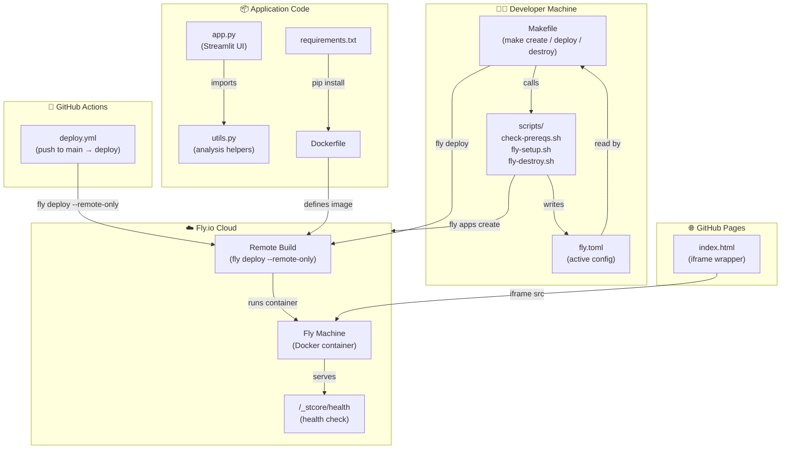
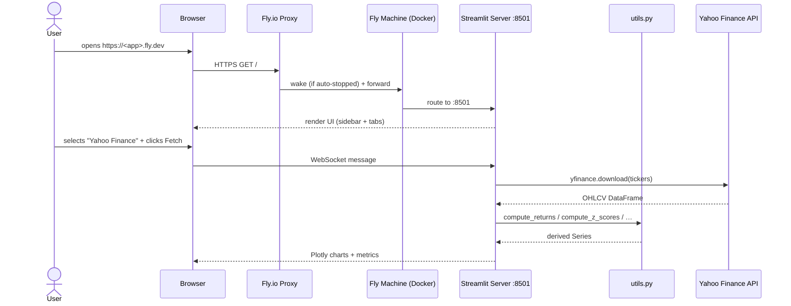
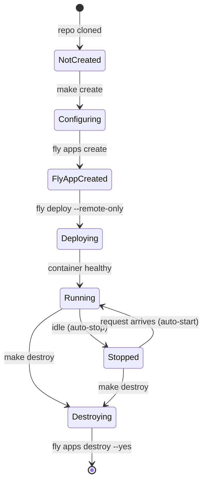
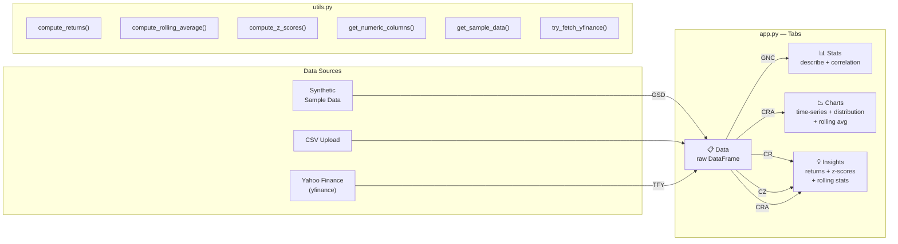
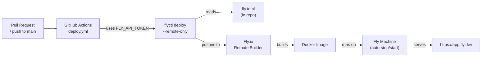

# Formula Architecture — Streamlit Quantitative Analysis PoC

This document explains **why every file exists**, how the components relate to
each other, and how data and requests flow through the system.  Mermaid
diagrams are provided for each architectural dimension.

---

## 1. Repository file map

```
streamlit/
├── app.py                        ← Streamlit UI entry point
├── utils.py                      ← Pure-Python analysis helpers
├── requirements.txt              ← Python runtime dependencies
├── Dockerfile                    ← Container image (builder + slim runtime)
├── fly.toml                      ← Active Fly.io deployment config
├── fly.toml.example              ← Reference / template config
├── Makefile                      ← Developer CLI (create / deploy / destroy …)
├── index.html                    ← GitHub Pages wrapper (iframe)
├── copilot.md                    ← AI pair-programming context & OKRs
├── real.md                       ← Real-world OKRs (create/destroy lifecycle)
├── formula_architecture.md       ← This file
├── contributor.md                ← Contributor acknowledgements
├── .github/
│   └── workflows/
│       └── deploy.yml            ← GitHub Actions CI/CD
└── scripts/
    ├── check-prereqs.sh          ← Prerequisite checker
    ├── fly-setup.sh              ← Interactive creation wizard
    └── fly-destroy.sh            ← Teardown with confirmation
```

---

## 2. Component overview



---

## 3. Request flow (user → app)



---

## 4. Infrastructure lifecycle (create → operate → destroy)



---

## 5. Why each file exists

### `app.py`
The single-file Streamlit application.  It owns all UI logic: the page
configuration, the sidebar (data-source selector, filters, parameters), and the
four analysis tabs.  Keeping all UI in one file makes it easy to run locally
(`streamlit run app.py`) and to trace the full user journey.

### `utils.py`
Pure helper functions with no Streamlit imports.  Separating them from `app.py`
means they can be unit-tested without launching a Streamlit server and can be
reused in scripts or notebooks.

### `requirements.txt`
Pinned minimum versions for the five runtime libraries.  Referenced by both
the local `pip install -r requirements.txt` workflow and by the `Dockerfile`
`RUN pip install` step.

### `Dockerfile`
Multi-stage build:
* **Stage 1 (builder)** — installs `build-essential` and all Python packages
  into a virtual environment `/opt/venv`.
* **Stage 2 (runtime)** — copies only `/opt/venv` and the application source
  into a slim image.  Runs as a non-root user (`appuser`) for security.

This pattern keeps the final image small and avoids shipping build tools to
production.

### `fly.toml`
The active Fly.io configuration.  Key settings:

| Setting | Value | Reason |
|---------|-------|--------|
| `internal_port` | 8501 | Streamlit listens on 8501 by default |
| `auto_stop_machines` | true | VMs stop when idle → zero idle cost |
| `auto_start_machines` | true | VMs wake on first request |
| `min_machines_running` | 0 | Scale-to-zero enabled |
| `/_stcore/health` | health check | Streamlit's built-in health endpoint |

### `fly.toml.example`
A reference copy of a working `fly.toml` committed to the repo.  Engineers
can read it to understand the expected shape of the config before running
`make create`.

### `Makefile`
Provides short, memorable commands (`make create`, `make deploy`,
`make destroy`, etc.) that wrap the underlying `flyctl` calls and shell
scripts.  The `check-prereqs` target is declared as a dependency of every
lifecycle command so prerequisites are always validated first.

### `scripts/check-prereqs.sh`
Validates that `flyctl` is installed and the user is authenticated before any
Fly.io API call is attempted.  Exits with a non-zero code so `make` stops early
with a clear error message.

### `scripts/fly-setup.sh`
Interactive wizard that collects five configuration values, writes a valid
`fly.toml`, calls `fly apps create`, and optionally calls `fly deploy`.
Running it in a script (rather than inline in the Makefile) keeps the wizard
logic readable and testable.

### `scripts/fly-destroy.sh`
Reads the app name from `fly.toml`, displays a clear warning listing every
resource that will be deleted, and requires the user to type the exact app name
before calling `fly apps destroy --yes`.  The typed-confirmation guard prevents
accidents.

### `.github/workflows/deploy.yml`
CI/CD pipeline: on every push to `main` it installs `flyctl` and runs
`flyctl deploy --remote-only` using the `FLY_API_TOKEN` repository secret.
This ensures the live app always reflects the latest code on `main`.

### `index.html`
A GitHub Pages entry point that embeds the Fly.io app in an `<iframe>`.
This allows the app to be linked from GitHub Pages
(`https://rifaterdemsahin.github.io/streamlit/`) while the actual compute runs
on Fly.io.

### `copilot.md`
GitHub Copilot context file.  Provides project background, OKRs, coding
conventions, and common task prompts so AI pair-programming tools produce
suggestions consistent with this codebase.

### `real.md`
Real-world OKR document focused on the Fly.io resource lifecycle (background
create and destroy).  Defines concrete success metrics for the PoC.

### `contributor.md`
Acknowledgements for contributors to the project.

---

## 6. Data-layer dependency graph



---

## 7. CI/CD flow


